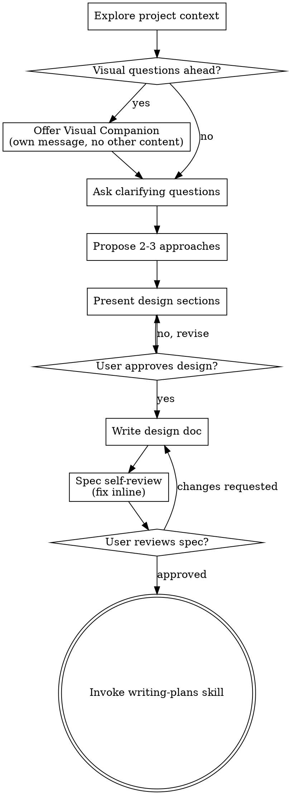

# 将想法通过头脑风暴转化为设计

通过自然的协作对话，帮助将想法转化为完整的设计和规格说明。

首先了解当前项目上下文，然后逐个提问来完善想法。一旦理解了要构建的内容，就展示设计方案并获得用户批准。

<HARD-GATE>
在展示设计方案并获得用户批准之前，不要调用任何实现 skill、编写任何代码、搭建任何项目框架或采取任何实现行动。这适用于所有项目，无论看起来多么简单。
</HARD-GATE>

## 反模式："这太简单了，不需要设计"

每个项目都要经过这个流程。一个待办事项列表、一个单函数工具、一个配置变更——全都需要。"简单"的项目恰恰是未经审视的假设导致最多无用功的地方。设计可以很简短（对于真正简单的项目只需几句话），但你必须展示并获得批准。

## 检查清单

你必须为以下每个条目创建任务并按顺序完成：

1. **探索项目上下文** — 查看文件、文档、最近的 commit
2. **提供可视化辅助工具**（如果话题涉及视觉问题）— 这是独立的一条消息，不与澄清问题合并。参见下方"可视化辅助工具"章节。
3. **提出澄清问题** — 一次一个，理解目的/约束/成功标准
4. **提出 2-3 个方案** — 附带权衡分析和你的推荐
5. **展示设计** — 按复杂度分章节，每个章节后获得用户批准
6. **编写设计文档** — 保存到 `docs/superpowers/specs/YYYY-MM-DD-<topic>-design.md` 并 commit
7. **规格自审** — 快速内联检查占位符、矛盾、歧义、范围（见下文）
8. **用户审阅书面规格** — 在继续之前请用户审阅规格文件
9. **过渡到实现** — 调用 writing-plans skill 创建实现计划

## 流程图

**终止状态是调用 writing-plans。** 不要调用 frontend-design、mcp-builder 或任何其他实现 skill。brainstorming 之后唯一应该调用的 skill 是 writing-plans。

## 流程详解

**理解想法：**

- 先查看当前项目状态（文件、文档、最近的 commit）
- 在提出详细问题之前，先评估范围：如果请求描述了多个独立子系统（例如"构建一个包含聊天、文件存储、计费和分析的平台"），立即指出。不要在需要先分解的项目上花时间精细化细节。
- 如果项目对单个规格来说太大，帮助用户分解为子项目：独立的部分是什么，它们之间如何关联，应该按什么顺序构建？然后按照正常的设计流程对第一个子项目进行头脑风暴。每个子项目都有自己的规格 -> 计划 -> 实现循环。
- 对于范围适当的项目，逐个提问来完善想法
- 尽可能使用选择题，但开放式问题也可以
- 每条消息只问一个问题——如果一个话题需要更多探讨，就拆分成多个问题
- 重点理解：目的、约束、成功标准

**探索方案：**

- 提出 2-3 个不同的方案及其权衡
- 以对话方式展示选项，附上你的推荐和理由
- 先展示推荐方案并解释原因

**展示设计：**

- 一旦你认为理解了要构建的内容，就展示设计
- 根据复杂度调整每个章节的篇幅：如果简单明了就几句话，如果有细微之处可以到 200-300 字
- 每个章节后询问是否看起来没问题
- 涵盖：架构、组件、数据流、错误处理、测试
- 准备好在有些地方不清楚时回头澄清

**为隔离性和清晰度而设计：**

- 将系统分解为更小的单元，每个单元有一个明确的目的，通过定义良好的接口进行通信，并且可以独立地理解和测试
- 对于每个单元，你应该能回答：它做什么，如何使用它，它依赖什么？
- 别人不看内部实现能理解一个单元做什么吗？你能在不破坏使用者的情况下修改内部实现吗？如果不能，边界需要改进。
- 更小的、边界清晰的单元也更容易处理——你在推理能同时放入上下文的代码时效果更好，文件聚焦时你的编辑也更可靠。当文件变大时，通常是它承担了太多职责的信号。

**在现有代码库中工作：**

- 在提出修改建议之前先探索当前结构。遵循现有模式。
- 当现有代码存在影响工作的问题时（例如文件过大、边界不清、职责混乱），在设计中纳入有针对性的改进——就像一个优秀的开发者会改善他正在工作的代码一样。
- 不要提出无关的重构。保持对当前目标的聚焦。

## 设计之后

**文档：**

- 将经过验证的设计（规格）写入 `docs/superpowers/specs/YYYY-MM-DD-<topic>-design.md`
  - （用户对规格位置的偏好优先于此默认值）
- 如果可用，使用 elements-of-style:writing-clearly-and-concisely skill
- 将设计文档 commit 到 git

**规格自审：**
编写规格文档后，用全新的视角审视它：

1. **占位符扫描：** 有任何 "TBD"、"TODO"、不完整的章节或模糊的需求吗？修复它们。
2. **内部一致性：** 有没有章节相互矛盾？架构是否与功能描述匹配？
3. **范围检查：** 这是否足够聚焦，可以用单个实现计划完成，还是需要分解？
4. **歧义检查：** 有没有需求可以被两种方式解读？如果有，选择一种并明确表述。

发现问题就地修复。不需要重新审阅——直接修复然后继续。

**用户审阅关卡：**
规格审阅通过后，在继续之前请用户审阅书面规格：

> "规格已编写并 commit 到 `<path>`。请审阅并告诉我在开始编写实现计划之前是否需要修改。"

等待用户回复。如果他们要求修改，进行修改并重新运行规格审阅流程。只有在用户批准后才继续。

**实现：**

- 调用 writing-plans skill 创建详细的实现计划
- 不要调用任何其他 skill。writing-plans 是下一步。

## 关键原则

- **一次一个问题** - 不要同时抛出多个问题让人应接不暇
- **优先使用选择题** - 在可能的情况下比开放式问题更容易回答
- **严格遵循 YAGNI** - 从所有设计中移除不必要的功能
- **探索替代方案** - 在确定之前始终提出 2-3 个方案
- **增量验证** - 展示设计，获得批准后再继续
- **保持灵活** - 当有些地方不清楚时回头澄清

## 可视化辅助工具

一个基于浏览器的辅助工具，用于在头脑风暴期间展示原型、图表和视觉选项。它作为一个工具存在——不是一种模式。接受辅助工具意味着它可以用于受益于视觉呈现的问题；这并不意味着每个问题都通过浏览器展示。

**提供辅助工具：** 当你预计即将到来的问题将涉及视觉内容（原型、布局、图表）时，征求一次同意：
> "我们正在讨论的一些内容如果能在浏览器中展示可能更容易理解。我可以在讨论过程中制作原型、图表、对比和其他视觉内容。这个功能还比较新，可能会消耗较多 token。想试试吗？（需要打开一个本地 URL）"

**此提议必须是独立的一条消息。** 不要将其与澄清问题、上下文摘要或任何其他内容混合。这条消息应该只包含上述提议，不含其他内容。等待用户回复后再继续。如果他们拒绝，继续纯文本的头脑风暴。

**逐个问题决定：** 即使用户接受后，也要为每个问题决定使用浏览器还是终端。判断标准是：**用户看到它比读到它能更好地理解吗？**

- **使用浏览器** 展示本质上是视觉化的内容——原型、线框图、布局对比、架构图、并排视觉设计
- **使用终端** 展示文本内容——需求问题、概念选择、权衡列表、A/B/C/D 文本选项、范围决策

关于 UI 话题的问题不会自动成为视觉问题。"在这个上下文中'个性'是什么意思？"是概念性问题——使用终端。"哪种向导布局更好？"是视觉问题——使用浏览器。

如果他们同意使用辅助工具，在继续之前阅读详细指南：
`skills/brainstorming/visual-companion.md`
