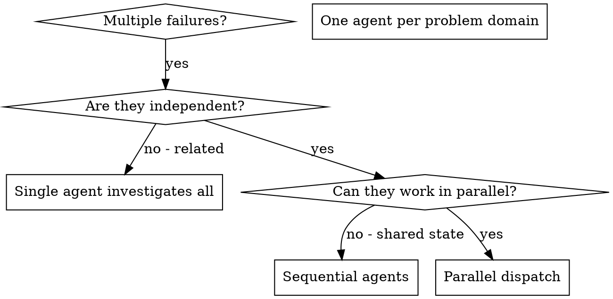

# 分发并行 Agent

## 概述

你将任务委派给具有隔离上下文的专门 agent。通过精确设计它们的指令和上下文，确保它们保持专注并成功完成任务。它们不应继承你的会话上下文或历史记录——你需要精确构建它们所需的一切。这也为协调工作保留了你自己的上下文。

当你遇到多个不相关的失败（不同的测试文件、不同的子系统、不同的 bug）时，按顺序逐个排查会浪费时间。每个调查都是独立的，可以并行进行。

**核心原则：** 每个独立的问题域分发一个 agent。让它们并发工作。

## 何时使用



**适用场景：**
- 3 个以上测试文件因不同根因失败
- 多个子系统独立损坏
- 每个问题都可以在不依赖其他问题上下文的情况下理解
- 各调查之间没有共享状态

**不适用场景：**
- 失败之间有关联（修复一个可能修复其他的）
- 需要理解完整的系统状态
- agent 之间会互相干扰

## 模式

### 1. 识别独立问题域

按故障类型分组：
- 文件 A 测试：工具审批流程
- 文件 B 测试：批处理完成行为
- 文件 C 测试：中止功能

每个域都是独立的——修复工具审批不会影响中止测试。

### 2. 创建聚焦的 Agent 任务

每个 agent 需要：
- **明确的范围：** 一个测试文件或子系统
- **清晰的目标：** 让这些测试通过
- **约束条件：** 不要修改其他代码
- **预期输出：** 发现和修复内容的摘要

### 3. 并行分发

```typescript
// 在 Claude Code / AI 环境中
Task("Fix agent-tool-abort.test.ts failures")
Task("Fix batch-completion-behavior.test.ts failures")
Task("Fix tool-approval-race-conditions.test.ts failures")
// 三个同时运行
```

### 4. 审阅与集成

当 agent 返回时：
- 阅读每个摘要
- 验证修复之间没有冲突
- 运行完整测试套件
- 集成所有更改

## Agent Prompt 结构

好的 agent prompt 应该是：
1. **聚焦的** - 一个明确的问题域
2. **自包含的** - 包含理解问题所需的所有上下文
3. **明确输出要求** - agent 应该返回什么？

```markdown
Fix the 3 failing tests in src/agents/agent-tool-abort.test.ts:

1. "should abort tool with partial output capture" - expects 'interrupted at' in message
2. "should handle mixed completed and aborted tools" - fast tool aborted instead of completed
3. "should properly track pendingToolCount" - expects 3 results but gets 0

These are timing/race condition issues. Your task:

1. Read the test file and understand what each test verifies
2. Identify root cause - timing issues or actual bugs?
3. Fix by:
   - Replacing arbitrary timeouts with event-based waiting
   - Fixing bugs in abort implementation if found
   - Adjusting test expectations if testing changed behavior

Do NOT just increase timeouts - find the real issue.

Return: Summary of what you found and what you fixed.
```

## 常见错误

**错误：** 范围太广："Fix all the tests"——agent 会迷失方向
**正确：** 明确具体："Fix agent-tool-abort.test.ts"——范围聚焦

**错误：** 缺少上下文："Fix the race condition"——agent 不知道在哪里
**正确：** 提供上下文：粘贴错误信息和测试名称

**错误：** 缺少约束：agent 可能会重构所有代码
**正确：** 添加约束："Do NOT change production code" 或 "Fix tests only"

**错误：** 输出要求模糊："Fix it"——你不知道改了什么
**正确：** 明确要求："Return summary of root cause and changes"

## 不适用场景

**关联失败：** 修复一个可能修复其他的——先一起排查
**需要完整上下文：** 理解问题需要查看整个系统
**探索性调试：** 你还不知道哪里出了问题
**共享状态：** agent 之间会互相干扰（编辑相同文件、使用相同资源）

## 实际案例

**场景：** 重大重构后 3 个文件中出现 6 个测试失败

**失败情况：**
- agent-tool-abort.test.ts：3 个失败（时序问题）
- batch-completion-behavior.test.ts：2 个失败（工具未执行）
- tool-approval-race-conditions.test.ts：1 个失败（执行次数 = 0）

**决策：** 独立问题域——中止逻辑与批处理完成和竞态条件各自独立

**分发：**
```
Agent 1 → Fix agent-tool-abort.test.ts
Agent 2 → Fix batch-completion-behavior.test.ts
Agent 3 → Fix tool-approval-race-conditions.test.ts
```

**结果：**
- Agent 1：用基于事件的等待替换了超时
- Agent 2：修复了事件结构 bug（threadId 位置错误）
- Agent 3：添加了等待异步工具执行完成的逻辑

**集成：** 所有修复相互独立，无冲突，完整测试套件全部通过

**节省时间：** 3 个问题并行解决 vs 按顺序逐个解决

## 核心优势

1. **并行化** - 多个调查同时进行
2. **聚焦** - 每个 agent 范围窄小，需要跟踪的上下文更少
3. **独立性** - agent 之间互不干扰
4. **速度** - 3 个问题在 1 个问题的时间内解决

## 验证

agent 返回后：
1. **审阅每个摘要** - 理解变更了什么
2. **检查冲突** - agent 是否编辑了相同的代码？
3. **运行完整测试套件** - 验证所有修复协同工作
4. **抽样检查** - agent 可能会犯系统性错误

## 实际效果

来自调试会话（2025-10-03）：
- 3 个文件中有 6 个失败
- 3 个 agent 并行分发
- 所有调查并发完成
- 所有修复成功集成
- agent 变更之间零冲突
