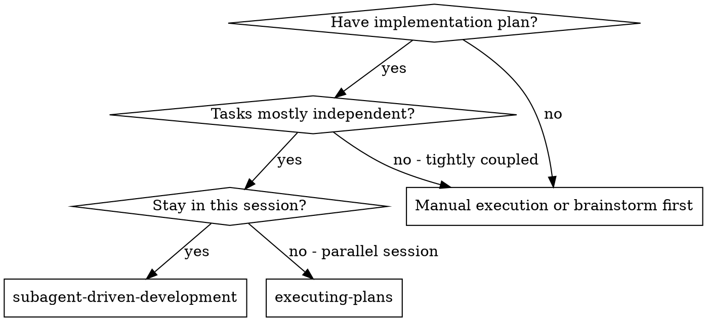
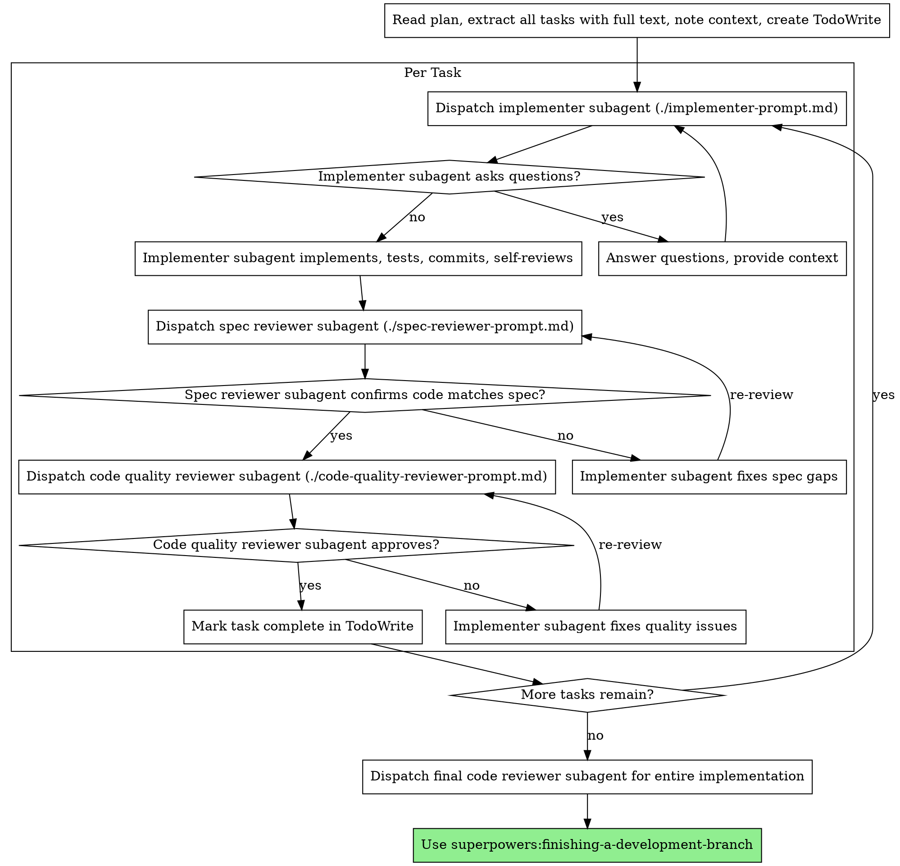

# Subagent 驱动开发

通过为每个任务派遣全新的 subagent 来执行计划，每个任务完成后进行两阶段审查：先审查规格合规性，再审查代码质量。

**为什么使用 subagent：** 你将任务委派给具有隔离上下文的专门 agent。通过精心构建它们的指令和上下文，你确保它们保持专注并成功完成任务。它们不应继承你的会话上下文或历史——你精确构建它们所需的内容。这也为你自己保留了用于协调工作的上下文。

**核心原则：** 每个任务一个全新 subagent + 两阶段审查（规格合规性 + 代码质量）= 高质量、快速迭代

## 何时使用



**与执行计划（并行会话）的对比：**
- 同一会话（无上下文切换）
- 每个任务使用全新 subagent（无上下文污染）
- 每个任务完成后进行两阶段审查：先审查规格合规性，再审查代码质量
- 更快的迭代（任务之间无需人工介入）

## 流程



## 模型选择

使用能够胜任各角色的最低成本模型，以节省费用并提高速度。

**机械性实现任务**（隔离的函数、明确的规格、1-2 个文件）：使用快速、低成本的模型。当计划描述充分时，大多数实现任务都是机械性的。

**集成和判断性任务**（多文件协调、模式匹配、调试）：使用标准模型。

**架构、设计和审查任务**：使用最强大的可用模型。

**任务复杂度信号：**
- 涉及 1-2 个文件且有完整规格 → 低成本模型
- 涉及多个文件且有集成问题 → 标准模型
- 需要设计判断或广泛的代码库理解 → 最强大的模型

## 处理实现者状态

实现者 subagent 会报告四种状态之一。对每种状态做出相应处理：

**DONE：** 进入规格合规性审查。

**DONE_WITH_CONCERNS：** 实现者完成了工作但标记了疑虑。在继续之前阅读这些疑虑。如果疑虑关于正确性或范围，在审查前解决它们。如果只是观察性的（例如"这个文件越来越大了"），记录下来并进入审查。

**NEEDS_CONTEXT：** 实现者需要未提供的信息。提供缺失的上下文并重新派遣。

**BLOCKED：** 实现者无法完成任务。评估阻塞原因：
1. 如果是上下文问题，提供更多上下文并使用相同模型重新派遣
2. 如果任务需要更多推理能力，使用更强大的模型重新派遣
3. 如果任务太大，拆分成更小的部分
4. 如果计划本身有误，向人类搭档升级

**绝不要**忽略升级请求或在不做更改的情况下让相同模型重试。如果实现者说它被阻塞了，说明有些东西需要改变。

## Prompt 模板

- `./implementer-prompt.md` - 派遣实现者 subagent
- `./spec-reviewer-prompt.md` - 派遣规格合规性审查者 subagent
- `./code-quality-reviewer-prompt.md` - 派遣代码质量审查者 subagent

## 工作流示例

```
你：我正在使用 Subagent-Driven Development 来执行这个计划。

[一次性读取计划文件：docs/superpowers/plans/feature-plan.md]
[提取所有 5 个任务的完整文本和上下文]
[使用所有任务创建 TodoWrite]

任务 1：Hook 安装脚本

[获取任务 1 的文本和上下文（已提取）]
[使用完整任务文本 + 上下文派遣实现 subagent]

实现者："在我开始之前——hook 应该安装在用户级别还是系统级别？"

你："用户级别（~/.config/superpowers/hooks/）"

实现者："明白了。开始实现……"
[稍后] 实现者：
  - 实现了 install-hook 命令
  - 添加了测试，5/5 通过
  - 自审查：发现遗漏了 --force 标志，已添加
  - 已提交

[派遣规格合规性审查者]
规格审查者：✅ 规格合规——所有要求已满足，无多余内容

[获取 git SHA，派遣代码质量审查者]
代码审查者：优点：测试覆盖好，代码整洁。问题：无。已通过。

[标记任务 1 完成]

任务 2：恢复模式

[获取任务 2 的文本和上下文（已提取）]
[使用完整任务文本 + 上下文派遣实现 subagent]

实现者：[无问题，直接开始]
实现者：
  - 添加了 verify/repair 模式
  - 8/8 测试通过
  - 自审查：一切正常
  - 已提交

[派遣规格合规性审查者]
规格审查者：❌ 问题：
  - 缺失：进度报告（规格说"每 100 项报告一次"）
  - 多余：添加了 --json 标志（未要求）

[实现者修复问题]
实现者：移除了 --json 标志，添加了进度报告

[规格审查者再次审查]
规格审查者：✅ 现在符合规格

[派遣代码质量审查者]
代码审查者：优点：扎实。问题（Important）：魔法数字 (100)

[实现者修复]
实现者：提取了 PROGRESS_INTERVAL 常量

[代码审查者再次审查]
代码审查者：✅ 已通过

[标记任务 2 完成]

...

[所有任务完成后]
[派遣最终 code-reviewer]
最终审查者：所有要求已满足，可以合并

完成！
```

## 优势

**相比手动执行：**
- Subagent 自然遵循 TDD
- 每个任务上下文全新（不会混淆）
- 并行安全（subagent 之间不会互相干扰）
- Subagent 可以提问（工作开始前和进行中都可以）

**相比执行计划：**
- 同一会话（无交接）
- 持续推进（无需等待）
- 审查检查点自动完成

**效率提升：**
- 无文件读取开销（控制器提供完整文本）
- 控制器精确策划所需的上下文
- Subagent 预先获得完整信息
- 问题在工作开始前就浮出水面（而不是之后）

**质量关卡：**
- 自审查在交接前发现问题
- 两阶段审查：规格合规性，然后代码质量
- 审查循环确保修复确实有效
- 规格合规性审查防止过度/不足构建
- 代码质量审查确保实现质量良好

**成本：**
- 更多 subagent 调用（每个任务需要实现者 + 2 个审查者）
- 控制器做更多准备工作（预先提取所有任务）
- 审查循环增加迭代次数
- 但能早期发现问题（比后期调试更便宜）

## 红线警告

**绝不要：**
- 在没有用户明确同意的情况下在 main/master 分支上开始实现
- 跳过审查（规格合规性或代码质量）
- 带着未修复的问题继续推进
- 并行派遣多个实现 subagent（会产生冲突）
- 让 subagent 自己读取计划文件（应提供完整文本）
- 跳过场景设定上下文（subagent 需要理解任务在整体中的位置）
- 忽略 subagent 的问题（在让它们继续之前先回答）
- 在规格合规性上接受"差不多"（规格审查者发现问题 = 未完成）
- 跳过审查循环（审查者发现问题 = 实现者修复 = 再次审查）
- 让实现者的自审查替代正式审查（两者都需要）
- **在规格合规性通过之前开始代码质量审查**（顺序错误）
- 在任何一个审查有未解决问题时就进入下一个任务

**如果 subagent 提问：**
- 清楚、完整地回答
- 如果需要，提供额外上下文
- 不要催促它们进入实现阶段

**如果审查者发现问题：**
- 实现者（同一个 subagent）修复问题
- 审查者再次审查
- 重复直到通过
- 不要跳过重新审查

**如果 subagent 无法完成任务：**
- 派遣修复 subagent 并附上具体指示
- 不要尝试手动修复（上下文污染）

## 集成

**必需的工作流 skill：**
- **superpowers:using-git-worktrees** - 必需：在开始之前设置隔离的工作空间
- **superpowers:writing-plans** - 创建此 skill 执行的计划
- **superpowers:requesting-code-review** - 审查者 subagent 的代码审查模板
- **superpowers:finishing-a-development-branch** - 所有任务完成后完成开发

**Subagent 应使用：**
- **superpowers:test-driven-development** - Subagent 为每个任务遵循 TDD

**替代工作流：**
- **superpowers:executing-plans** - 用于并行会话而非同一会话执行
