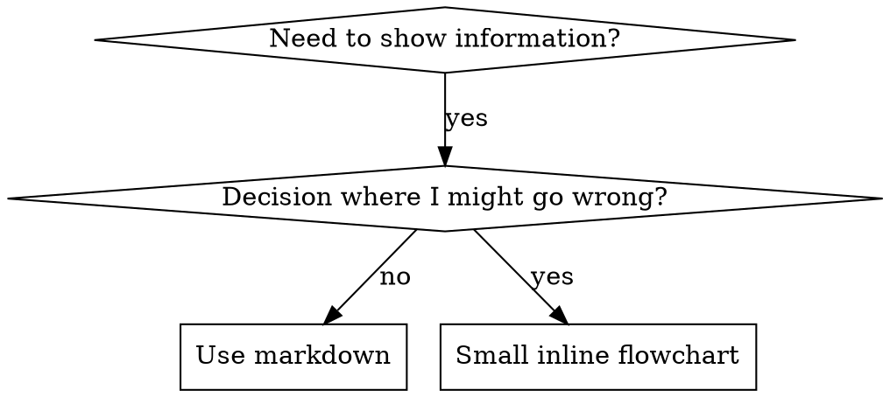

# 编写 Skill

## 概述

**编写 skill 就是将测试驱动开发应用于流程文档。**

**个人 skill 存放在 agent 特定目录中（Claude Code 使用 `~/.claude/skills`，Codex 使用 `~/.agents/skills/`）**

你编写测试用例（使用 subagent 的压力场景），观察它们失败（基线行为），编写 skill（文档），观察测试通过（agent 遵循），然后重构（堵住漏洞）。

**核心原则：** 如果你没有观察到 agent 在没有 skill 的情况下失败，你就不知道 skill 是否教了正确的东西。

**必需背景：** 在使用此 skill 之前，你必须理解 superpowers:test-driven-development。该 skill 定义了基本的红-绿-重构循环。本 skill 将 TDD 适配到文档领域。

**官方指南：** 关于 Anthropic 官方的 skill 编写最佳实践，请参阅 anthropic-best-practices.md。该文档提供了补充本 skill 中 TDD 导向方法的额外模式和指南。

## 什么是 Skill？

**skill** 是经过验证的技术、模式或工具的参考指南。Skill 帮助未来的 Claude 实例找到并应用有效的方法。

**Skill 是：** 可复用的技术、模式、工具、参考指南

**Skill 不是：** 关于你某次如何解决问题的叙事

## TDD 到 Skill 的映射

| TDD 概念 | Skill 创建 |
|-------------|----------------|
| **测试用例** | 使用 subagent 的压力场景 |
| **生产代码** | Skill 文档（SKILL.md） |
| **测试失败（红）** | Agent 在没有 skill 时违反规则（基线） |
| **测试通过（绿）** | Agent 在有 skill 时遵循规则 |
| **重构** | 堵住漏洞同时保持合规 |
| **先写测试** | 在编写 skill 之前运行基线场景 |
| **观察失败** | 记录 agent 使用的确切合理化借口 |
| **最少代码** | 编写针对那些特定违规的 skill |
| **观察通过** | 验证 agent 现在遵循规则 |
| **重构循环** | 发现新的合理化借口 → 堵住 → 重新验证 |

整个 skill 创建过程遵循红-绿-重构。

## 何时创建 Skill

**适合创建的情况：**
- 技术对你来说不是直觉上显而易见的
- 你会在不同项目中反复引用它
- 模式具有广泛适用性（非项目特定）
- 其他人也能受益

**不适合创建的情况：**
- 一次性解决方案
- 在其他地方已有充分文档的标准实践
- 项目特定的约定（放在 CLAUDE.md 中）
- 机械性约束（如果可以用正则/验证来强制执行，就自动化它——将文档留给需要判断的场景）

## Skill 类型

### 技术类
具有可遵循步骤的具体方法（condition-based-waiting、root-cause-tracing）

### 模式类
思考问题的方式（flatten-with-flags、test-invariants）

### 参考类
API 文档、语法指南、工具文档（office docs）

## 目录结构


```
skills/
  skill-name/
    SKILL.md              # 主参考文件（必需）
    supporting-file.*     # 仅在需要时
```

**扁平命名空间** - 所有 skill 在一个可搜索的命名空间中

**使用独立文件的情况：**
1. **大量参考内容**（100+ 行）- API 文档、全面的语法
2. **可复用工具** - 脚本、工具、模板

**保持内联的情况：**
- 原则和概念
- 代码模式（< 50 行）
- 其他所有内容

## SKILL.md 结构

**前置元数据（YAML）：**
- 两个必需字段：`name` 和 `description`（参见 [agentskills.io/specification](https://agentskills.io/specification) 了解所有支持的字段）
- 总计最多 1024 个字符
- `name`：仅使用字母、数字和连字符（无括号、特殊字符）
- `description`：第三人称，仅描述何时使用（不是它做什么）
  - 以 "Use when..." 开头，聚焦于触发条件
  - 包含具体症状、情境和上下文
  - **切勿总结 skill 的流程或工作流**（原因见 CSO 部分）
  - 尽量保持在 500 个字符以内

```markdown
---
name: Skill-Name-With-Hyphens
description: Use when [specific triggering conditions and symptoms]
---

# Skill Name

## Overview
这是什么？用 1-2 句话阐述核心原则。

## When to Use
[如果决策不明显，使用小型内联流程图]

带有症状和使用场景的要点列表
何时不使用

## Core Pattern（用于技术/模式类）
前后代码对比

## Quick Reference
表格或要点，便于快速扫描常见操作

## Implementation
简单模式使用内联代码
大量参考或可复用工具使用链接到文件

## Common Mistakes
什么会出错 + 修复方法

## Real-World Impact（可选）
具体成果
```


## Claude 搜索优化（CSO）

**对发现至关重要：** 未来的 Claude 需要能找到你的 skill

### 1. 丰富的 Description 字段

**目的：** Claude 读取 description 来决定为给定任务加载哪些 skill。让它回答："我现在应该读这个 skill 吗？"

**格式：** 以 "Use when..." 开头，聚焦于触发条件

**关键：Description = 何时使用，而非 Skill 做什么**

Description 应该仅描述触发条件。不要在 description 中总结 skill 的流程或工作流。

**为什么这很重要：** 测试发现，当 description 总结了 skill 的工作流时，Claude 可能会遵循 description 而不是阅读完整的 skill 内容。一个写着"任务间进行代码审查"的 description 导致 Claude 只做了一次审查，尽管 skill 的流程图清楚地展示了两次审查（规格合规然后代码质量）。

当 description 改为仅写"Use when executing implementation plans with independent tasks"（没有工作流总结）后，Claude 正确地阅读了流程图并遵循了两阶段审查流程。

**陷阱：** 总结工作流的 description 创建了一个 Claude 会走的捷径。Skill 正文变成了 Claude 跳过的文档。

```yaml
# ❌ 错误：总结了工作流 - Claude 可能遵循这个而不是阅读 skill
description: Use when executing plans - dispatches subagent per task with code review between tasks

# ❌ 错误：太多流程细节
description: Use for TDD - write test first, watch it fail, write minimal code, refactor

# ✅ 正确：仅触发条件，无工作流总结
description: Use when executing implementation plans with independent tasks in the current session

# ✅ 正确：仅触发条件
description: Use when implementing any feature or bugfix, before writing implementation code
```

**内容：**
- 使用具体的触发条件、症状和表明此 skill 适用的情境
- 描述*问题*（竞态条件、不一致行为）而非*语言特定症状*（setTimeout、sleep）
- 保持触发条件技术无关，除非 skill 本身是技术特定的
- 如果 skill 是技术特定的，在触发条件中明确说明
- 用第三人称编写（注入到系统提示词中）
- **切勿总结 skill 的流程或工作流**

```yaml
# ❌ 错误：太抽象、模糊，不包含何时使用
description: For async testing

# ❌ 错误：第一人称
description: I can help you with async tests when they're flaky

# ❌ 错误：提到了技术但 skill 不是特定于该技术的
description: Use when tests use setTimeout/sleep and are flaky

# ✅ 正确：以 "Use when" 开头，描述问题，无工作流
description: Use when tests have race conditions, timing dependencies, or pass/fail inconsistently

# ✅ 正确：技术特定的 skill 带有明确触发条件
description: Use when using React Router and handling authentication redirects
```

### 2. 关键词覆盖

使用 Claude 会搜索的词：
- 错误消息："Hook timed out"、"ENOTEMPTY"、"race condition"
- 症状："flaky"、"hanging"、"zombie"、"pollution"
- 同义词："timeout/hang/freeze"、"cleanup/teardown/afterEach"
- 工具：实际命令、库名称、文件类型

### 3. 描述性命名

**使用主动语态，动词在前：**
- ✅ `creating-skills` 而非 `skill-creation`
- ✅ `condition-based-waiting` 而非 `async-test-helpers`

### 4. Token 效率（关键）

**问题：** getting-started 和频繁引用的 skill 会加载到每次对话中。每个 token 都很重要。

**目标字数：**
- getting-started 工作流：每个 <150 词
- 频繁加载的 skill：总计 <200 词
- 其他 skill：<500 词（仍要简洁）

**技巧：**

**将细节移至工具帮助：**
```bash
# ❌ 错误：在 SKILL.md 中记录所有标志
search-conversations supports --text, --both, --after DATE, --before DATE, --limit N

# ✅ 正确：引用 --help
search-conversations supports multiple modes and filters. Run --help for details.
```

**使用交叉引用：**
```markdown
# ❌ 错误：重复工作流细节
When searching, dispatch subagent with template...
[20 lines of repeated instructions]

# ✅ 正确：引用其他 skill
Always use subagents (50-100x context savings). REQUIRED: Use [other-skill-name] for workflow.
```

**压缩示例：**
```markdown
# ❌ 错误：冗长的示例（42 词）
your human partner: "How did we handle authentication errors in React Router before?"
You: I'll search past conversations for React Router authentication patterns.
[Dispatch subagent with search query: "React Router authentication error handling 401"]

# ✅ 正确：精简的示例（20 词）
Partner: "How did we handle auth errors in React Router?"
You: Searching...
[Dispatch subagent → synthesis]
```

**消除冗余：**
- 不要重复交叉引用的 skill 中已有的内容
- 不要解释命令本身就能看出的内容
- 不要包含同一模式的多个示例

**验证：**
```bash
wc -w skills/path/SKILL.md
# getting-started 工作流：目标 <150 每个
# 其他频繁加载的：目标总计 <200
```

**用你做的事或核心洞察来命名：**
- ✅ `condition-based-waiting` > `async-test-helpers`
- ✅ `using-skills` 而非 `skill-usage`
- ✅ `flatten-with-flags` > `data-structure-refactoring`
- ✅ `root-cause-tracing` > `debugging-techniques`

**动名词（-ing）适合用于流程：**
- `creating-skills`、`testing-skills`、`debugging-with-logs`
- 主动语态，描述你正在进行的操作

### 4. 交叉引用其他 Skill

**编写引用其他 skill 的文档时：**

仅使用 skill 名称，带有明确的要求标记：
- ✅ 正确：`**REQUIRED SUB-SKILL:** Use superpowers:test-driven-development`
- ✅ 正确：`**REQUIRED BACKGROUND:** You MUST understand superpowers:systematic-debugging`
- ❌ 错误：`See skills/testing/test-driven-development`（不清楚是否必需）
- ❌ 错误：`@skills/testing/test-driven-development/SKILL.md`（强制加载，消耗上下文）

**为什么不用 @ 链接：** `@` 语法会立即强制加载文件，在你需要之前消耗 200k+ 上下文。

## 流程图使用



**仅在以下情况使用流程图：**
- 不明显的决策点
- 你可能过早停止的流程循环
- "何时使用 A vs B"的决策

**切勿在以下情况使用流程图：**
- 参考资料 → 表格、列表
- 代码示例 → Markdown 代码块
- 线性指令 → 编号列表
- 没有语义含义的标签（step1、helper2）

graphviz 样式规则请参见 @graphviz-conventions.dot。

**为你的人类搭档可视化：** 使用此目录中的 `render-graphs.js` 将 skill 的流程图渲染为 SVG：
```bash
./render-graphs.js ../some-skill           # 每个图表单独渲染
./render-graphs.js ../some-skill --combine # 所有图表合并为一个 SVG
```

## 代码示例

**一个优秀的示例胜过多个平庸的示例**

选择最相关的语言：
- 测试技术 → TypeScript/JavaScript
- 系统调试 → Shell/Python
- 数据处理 → Python

**好的示例：**
- 完整且可运行
- 注释充分，解释为什么
- 来自真实场景
- 清晰展示模式
- 可直接适配（非通用模板）

**不要：**
- 用 5+ 种语言实现
- 创建填空模板
- 编写人为构造的示例

你擅长移植——一个优秀的示例就够了。

## 文件组织

### 自包含 Skill
```
defense-in-depth/
  SKILL.md    # 所有内容内联
```
适用场景：所有内容都能放下，无需大量参考资料

### 带可复用工具的 Skill
```
condition-based-waiting/
  SKILL.md    # 概述 + 模式
  example.ts  # 可适配的工作辅助代码
```
适用场景：工具是可复用代码，而非仅仅是叙述

### 带大量参考资料的 Skill
```
pptx/
  SKILL.md       # 概述 + 工作流
  pptxgenjs.md   # 600 行 API 参考
  ooxml.md       # 500 行 XML 结构
  scripts/       # 可执行工具
```
适用场景：参考资料过大无法内联

## 铁律（与 TDD 相同）

```
没有失败的测试，就不能编写 SKILL
```

这适用于新 skill 和对现有 skill 的编辑。

先写 skill 再测试？删除它。从头开始。
编辑 skill 但未测试？同样违规。

**没有例外：**
- 不适用于"简单的添加"
- 不适用于"只是添加一个部分"
- 不适用于"文档更新"
- 不要将未测试的变更保留为"参考"
- 不要在运行测试时"调整"
- 删除就是删除

**必需背景：** superpowers:test-driven-development skill 解释了为什么这很重要。相同的原则适用于文档。

## 测试所有 Skill 类型

不同的 skill 类型需要不同的测试方法：

### 纪律执行类 Skill（规则/要求）

**示例：** TDD、verification-before-completion、designing-before-coding

**测试方式：**
- 学术问题：他们是否理解规则？
- 压力场景：他们在压力下是否遵循？
- 多重压力组合：时间 + 沉没成本 + 权威 + 疲惫
- 识别合理化借口并添加明确的反制措施

**成功标准：** Agent 在最大压力下遵循规则

### 技术类 Skill（操作指南）

**示例：** condition-based-waiting、root-cause-tracing、defensive-programming

**测试方式：**
- 应用场景：他们能否正确应用该技术？
- 变体场景：他们能否处理边界情况？
- 缺失信息测试：指令是否有遗漏？

**成功标准：** Agent 成功将技术应用于新场景

### 模式类 Skill（心智模型）

**示例：** reducing-complexity、information-hiding 概念

**测试方式：**
- 识别场景：他们是否能识别模式何时适用？
- 应用场景：他们能否使用心智模型？
- 反例：他们是否知道何时不应用？

**成功标准：** Agent 正确识别何时/如何应用模式

### 参考类 Skill（文档/API）

**示例：** API 文档、命令参考、库指南

**测试方式：**
- 检索场景：他们能否找到正确的信息？
- 应用场景：他们能否正确使用找到的信息？
- 缺口测试：常见使用场景是否被覆盖？

**成功标准：** Agent 找到并正确应用参考信息

## 跳过测试的常见合理化借口

| 借口 | 现实 |
|--------|---------|
| "Skill 显然很清楚" | 对你清楚 ≠ 对其他 agent 清楚。测试它。 |
| "这只是参考资料" | 参考资料可能有遗漏、不清楚的部分。测试检索。 |
| "测试太过了" | 未测试的 skill 总有问题。15 分钟测试节省数小时。 |
| "出问题了再测试" | 问题 = agent 无法使用 skill。部署前测试。 |
| "测试太繁琐了" | 测试比在生产环境中调试坏掉的 skill 更省事。 |
| "我确信它没问题" | 过度自信保证出问题。无论如何都要测试。 |
| "学术审查就够了" | 阅读 ≠ 使用。测试应用场景。 |
| "没时间测试" | 部署未测试的 skill 会浪费更多时间在后续修复上。 |

**以上所有都意味着：部署前测试。没有例外。**

## 让 Skill 对抗合理化无懈可击

执行纪律的 skill（如 TDD）需要抵抗合理化。Agent 很聪明，在压力下会找到漏洞。

**心理学说明：** 理解说服技术为什么有效可以帮助你系统地应用它们。参见 persuasion-principles.md 了解研究基础（Cialdini, 2021; Meincke et al., 2025）中关于权威、承诺、稀缺性、社会认同和统一性原则的内容。

### 明确堵住每个漏洞

不要只陈述规则——禁止特定的变通方法：

<Bad>
```markdown
Write code before test? Delete it.
```
</Bad>

<Good>
```markdown
Write code before test? Delete it. Start over.

**No exceptions:**
- Don't keep it as "reference"
- Don't "adapt" it while writing tests
- Don't look at it
- Delete means delete
```
</Good>

### 处理"精神 vs 字面"的争论

尽早添加基本原则：

```markdown
**Violating the letter of the rules is violating the spirit of the rules.**
```

这切断了整类"我在遵循精神"的合理化借口。

### 构建合理化表

从基线测试中捕获合理化借口（见下方测试部分）。Agent 的每个借口都进入表格：

```markdown
| Excuse | Reality |
|--------|---------|
| "Too simple to test" | Simple code breaks. Test takes 30 seconds. |
| "I'll test after" | Tests passing immediately prove nothing. |
| "Tests after achieve same goals" | Tests-after = "what does this do?" Tests-first = "what should this do?" |
```

### 创建危险信号列表

让 agent 在合理化时容易自我检查：

```markdown
## Red Flags - STOP and Start Over

- Code before test
- "I already manually tested it"
- "Tests after achieve the same purpose"
- "It's about spirit not ritual"
- "This is different because..."

**All of these mean: Delete code. Start over with TDD.**
```

### 更新 CSO 以覆盖违规症状

在 description 中添加：你即将违反规则时的症状：

```yaml
description: use when implementing any feature or bugfix, before writing implementation code
```

## Skill 的红-绿-重构

遵循 TDD 循环：

### 红：编写失败的测试（基线）

在没有 skill 的情况下使用 subagent 运行压力场景。记录确切行为：
- 他们做了什么选择？
- 他们使用了什么合理化借口（逐字记录）？
- 哪些压力触发了违规？

这就是"观察测试失败"——你必须在编写 skill 之前看到 agent 自然会做什么。

### 绿：编写最小 Skill

编写针对那些特定合理化借口的 skill。不要为假设情况添加额外内容。

使用 skill 运行相同场景。Agent 现在应该遵循。

### 重构：堵住漏洞

Agent 找到了新的合理化借口？添加明确的反制措施。重新测试直到无懈可击。

**测试方法论：** 参见 @testing-skills-with-subagents.md 了解完整的测试方法论：
- 如何编写压力场景
- 压力类型（时间、沉没成本、权威、疲惫）
- 系统地堵住漏洞
- 元测试技术

## 反模式

### ❌ 叙事型示例
"在 2025-10-03 的会话中，我们发现空的 projectDir 导致了..."
**为什么不好：** 太具体，无法复用

### ❌ 多语言稀释
example-js.js, example-py.py, example-go.go
**为什么不好：** 质量平庸，维护负担

### ❌ 流程图中的代码
```dot
step1 [label="import fs"];
step2 [label="read file"];
```
**为什么不好：** 无法复制粘贴，难以阅读

### ❌ 通用标签
helper1, helper2, step3, pattern4
**为什么不好：** 标签应该有语义含义

## 停下：在进入下一个 Skill 之前

**编写完任何 skill 后，你必须停下并完成部署流程。**

**不要：**
- 批量创建多个 skill 而不逐一测试
- 在当前 skill 验证通过前就开始下一个
- 因为"批处理更高效"而跳过测试

**下面的部署清单对每个 skill 都是强制性的。**

部署未测试的 skill = 部署未测试的代码。这违反了质量标准。

## Skill 创建清单（TDD 适配版）

**重要：使用 TodoWrite 为以下清单中的每个条目创建 todo。**

**红色阶段 - 编写失败的测试：**
- [ ] 创建压力场景（纪律类 skill 需要 3+ 组合压力）
- [ ] 在没有 skill 的情况下运行场景 - 逐字记录基线行为
- [ ] 识别合理化/失败中的模式

**绿色阶段 - 编写最小 Skill：**
- [ ] 名称仅使用字母、数字、连字符（无括号/特殊字符）
- [ ] YAML 前置元数据包含必需的 `name` 和 `description` 字段（最多 1024 字符；参见 [spec](https://agentskills.io/specification)）
- [ ] Description 以 "Use when..." 开头，包含具体触发条件/症状
- [ ] Description 使用第三人称编写
- [ ] 全文包含搜索关键词（错误、症状、工具）
- [ ] 清晰的概述和核心原则
- [ ] 针对红色阶段识别的特定基线失败进行处理
- [ ] 代码内联或链接到独立文件
- [ ] 一个优秀的示例（非多语言）
- [ ] 使用 skill 运行场景 - 验证 agent 现在遵循

**重构阶段 - 堵住漏洞：**
- [ ] 从测试中识别新的合理化借口
- [ ] 添加明确的反制措施（如果是纪律类 skill）
- [ ] 从所有测试迭代构建合理化表
- [ ] 创建危险信号列表
- [ ] 重新测试直到无懈可击

**质量检查：**
- [ ] 仅在决策不明显时使用小流程图
- [ ] 快速参考表
- [ ] 常见错误部分
- [ ] 无叙事式故事讲述
- [ ] 仅在工具或大量参考资料时使用支持文件

**部署：**
- [ ] 将 skill 提交到 git 并推送到你的 fork（如果已配置）
- [ ] 考虑通过 PR 回馈（如果具有广泛用途）

## 发现工作流

未来的 Claude 如何找到你的 skill：

1. **遇到问题**（"测试不稳定"）
3. **找到 SKILL**（description 匹配）
4. **扫描概述**（这相关吗？）
5. **阅读模式**（快速参考表）
6. **加载示例**（仅在实现时）

**为此流程优化** - 将可搜索的术语尽早、频繁地放置。

## 底线

**创建 skill 就是流程文档的 TDD。**

同样的铁律：没有失败的测试就不能编写 skill。
同样的循环：红（基线）→ 绿（编写 skill）→ 重构（堵住漏洞）。
同样的收益：更高的质量、更少的意外、无懈可击的结果。

如果你对代码遵循 TDD，就对 skill 也遵循它。这是同样的纪律应用于文档。
